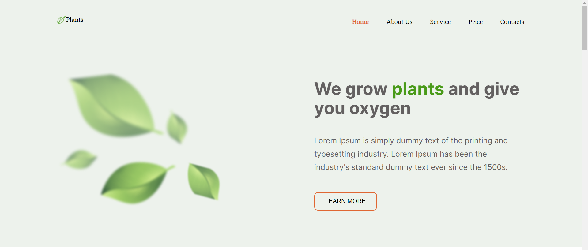

# gardening

One-page website Plants about gardening services.

### Self-study project from [RS School](https://rs.school/).

It is necessary to make a website from Figma-layout. Add interactive elements, make responsive design (this stage is in progress).

### Preview
